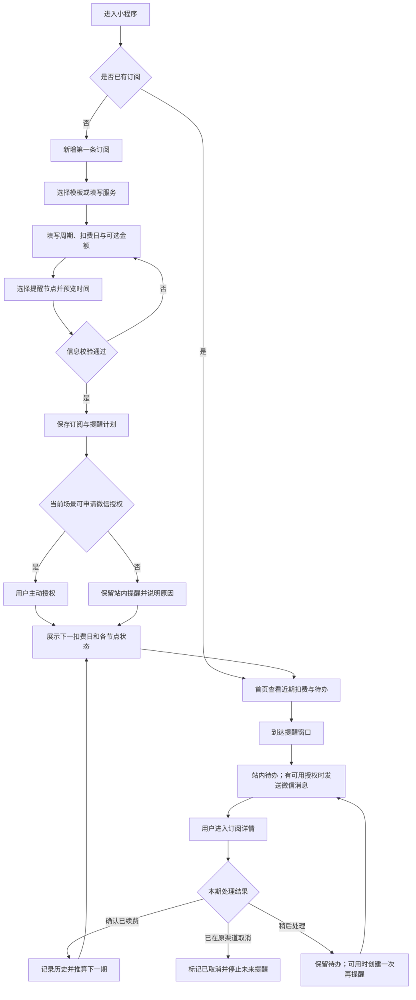
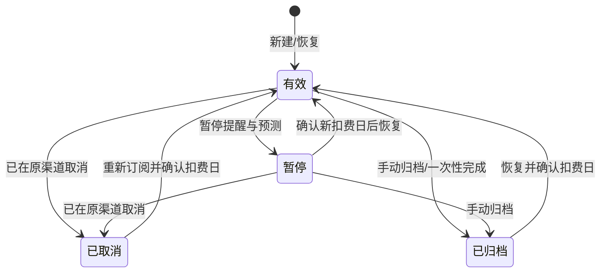

# 续订清单 - 订阅流程交互逻辑评审稿

> 文档版本：V0.1  
> 文档日期：2026-08-03  
> 评审范围：订阅录入、提醒授权、到期提醒、续费处理、取消/暂停/归档、异常恢复  
> 依据：当前交互原型、现有 PRD、订阅提醒功能规格及技术调研

## 1. 评审结论

产品主链路成立：**记录订阅 -> 建立提醒 -> 到期前触达 -> 用户处理 -> 更新下一期或停止提醒**。

当前原型已经能演示订阅台账的大部分交互，但还不能作为真实提醒产品上线。上线前必须先统一以下逻辑：

1. “已开启提醒”不能只用一个布尔值表示，需要区分站内提醒、微信通道绑定、模板授权次数和具体提醒是否已排期。
2. “确认续费”必须按“订阅 + 本期扣费日”幂等，当前原型可重复确认并连续推进扣费日，属于阻断级问题。
3. 自动续费关闭、暂停、取消、归档的语义需要严格分开，且必须同步影响提醒与统计。
4. 月末循环必须保留原始锚点，例如 1 月 31 日 -> 2 月 28 日 -> 3 月 31 日，不能永久变成每月 28 日。
5. 微信能否长期发送第三方订阅提醒存在平台审核风险，产品不能承诺“开启一次后永久提醒”。

在上述问题修正后，整体逻辑可形成完整 MVP 闭环。

## 2. 产品边界

### 2.1 产品负责

- 记录用户手动提供的订阅、预计金额和预计扣费日。
- 在站内展示到期待办，并在具备有效通知能力时发送微信提醒。
- 记录用户对本期订阅的处理结果。
- 根据周期推算下一次预计扣费日。

### 2.2 产品不负责

- 不读取用户的微信、支付宝、银行卡或应用商店账单。
- 不代替用户取消、付款、退款或阻止扣费。
- 不保证服务商实际扣费日、金额与记录一致。
- “消息已发送”只代表通知通道接受，不代表用户已阅读或处理。

所有出现“取消订阅”的地方都应明确为“用户已在原渠道取消后，在清单中标记取消”。

## 3. 角色与核心对象

| 对象 | 作用 | 关键状态 |
| --- | --- | --- |
| 用户 | 录入、授权、处理订阅 | 登录状态、时区、通知通道状态 |
| 订阅 | 描述一项持续或一次性费用 | 有效、暂停、已取消、已归档 |
| 本期账期 | 描述某个预计扣费日 | 未处理、已续费、已取消、稍后处理 |
| 提醒计划 | 某个账期的一个提醒节点 | 待排期、待发送、已发送、失败、已取消、授权不足 |
| 通知授权 | 决定某次消息能否发送 | 未绑定、可申请、可用次数、已耗尽、已失效 |

“订阅状态”和“本期处理状态”建议分开保存。否则“待处理”既像订阅状态又像账期状态，后续统计和历史记录容易混乱。

## 4. 推荐主流程



## 5. 分阶段交互

### 5.1 首次进入

| 场景 | 用户看到 | 用户动作 | 系统结果 |
| --- | --- | --- | --- |
| 无数据 | 简短价值说明、隐私提示、一个主按钮 | 添加第一条订阅 | 进入新增页 |
| 有本地未登录数据 | 本地记录及“尚未同步”提示 | 登录/继续使用 | 登录后合并或确认覆盖策略 |
| 已登录 | 近期扣费、待处理事项、通知可用性 | 查看或新增 | 进入相应页面 |

建议首次使用允许先录入，保存云端前再登录。登录后若云端已有数据，必须设计合并规则，不能直接覆盖任一侧数据。

### 5.2 新增订阅

#### 字段规则

| 字段 | 是否必填 | 推荐规则 |
| --- | --- | --- |
| 服务名称 | 是 | 1-30 字符 |
| 套餐名称 | 否 | 最多 30 字符 |
| 分类 | 是 | 默认“其他” |
| 金额 | 否 | 未知与 0 元必须区分；最多两位小数 |
| 币种 | 金额存在时必填 | 不同币种分别汇总，不自动换汇 |
| 计费周期 | 是 | 每周、每月、每季度、每半年、每年、一次性 |
| 下次扣费日 | 是 | 新建时不能早于今天 |
| 自动续费 | 是 | 默认开启；关闭后改用“到期”文案 |
| 付款渠道 | 否 | 微信、支付宝、App Store、信用卡、官网、其他 |
| 提醒节点 | 是 | 至少一个站内提醒节点 |
| 备注/取消路径 | 否 | 提示不要填写密码、完整卡号等敏感信息 |

#### 保存规则

1. 页面实时展示每个提醒节点的日期、时间和发送能力，而不只展示最早一个日期。
2. 扣费日已进入提醒窗口时，不丢弃过期节点：创建一条“尽快提醒”，其余未来节点正常保留。
3. 疑似重复条件建议为：服务名称相同、金额相同、扣费日在前后 3 天内、且原记录仍有效。
4. 重复只做提示，用户确认后仍可保存，以支持同服务的不同账号。
5. 保存成功后进入详情页，明确展示“已保存”“下次扣费日”“提醒是否可发送”。

### 5.3 通知授权

通知交互不能表达为简单的“提醒开关”，建议展示以下状态：

| 状态 | 页面文案 | 可执行动作 |
| --- | --- | --- |
| 未绑定通道 | 仅站内提醒 | 绑定/关注通知通道 |
| 已绑定但无本次授权 | 微信提醒尚不可发送 | 在用户主动操作场景申请授权 |
| 有可用授权 | 已安排 N 个微信提醒 | 查看具体节点 |
| 授权次数不足 | 部分节点仅站内提醒 | 补充授权或减少微信节点 |
| 授权失效/取消关注 | 微信提醒已暂停 | 重新绑定或检查通知权限 |
| 平台不支持 | 暂不支持微信定时提醒 | 仅保留站内待办，不作虚假承诺 |

授权请求只应由用户主动操作触发，例如保存订阅、开启某个微信提醒节点或点击“补充授权”。用户拒绝后不阻断订阅保存，也不在同一会话反复弹窗。

### 5.4 首页与列表

首页优先顺序建议为：

1. 已逾期且未处理。
2. 7 天内即将扣费。
3. 通知授权不足或发送失败。
4. 金额、扣费日等信息不完整。
5. 未来 30 天预计扣费和月均估算。

“未来 30 天预计扣费”应只包含有效订阅；暂停、取消、归档不计入。多币种必须分别显示，例如 `CNY 120 + USD 20`，不能直接相加后统一显示人民币。

### 5.5 到期提醒与处理

提醒消息至少包含：服务名称、预计扣费日、用户可识别的订阅标识；套餐和金额仅在已填写时展示。点击消息必须携带订阅 ID 与账期 ID，准确进入对应详情。

详情页主操作按时间和状态变化：

| 条件 | 主操作 | 次操作 |
| --- | --- | --- |
| 距扣费日大于 7 天 | 提前记录已续费 | 编辑、暂停、归档 |
| 进入提醒窗口 | 确认已续费 | 已取消、稍后处理 |
| 已逾期未处理 | 确认已续费 | 已取消、修正扣费日 |
| 本期已处理 | 查看处理结果 | 撤销本次处理（短时间内）或编辑下一期 |
| 已暂停/已取消/已归档 | 恢复订阅 | 查看历史 |

#### 确认已续费

1. 二次确认显示本期扣费日与推算后的下次扣费日。
2. 服务端以“订阅 ID + 本期扣费日 + 处理动作”保证幂等。
3. 保存本期金额快照与确认时间。
4. 周期性订阅推进到下一期并生成新提醒计划；一次性项目自动归档。
5. 已成功处理的旧提醒和历史记录不可被编辑订阅覆盖。

#### 已取消

1. 先提示产品不会代替用户向服务商取消，并展示已记录的取消路径。
2. 用户确认“已在原渠道完成取消”后，订阅变为已取消。
3. 立即取消所有未发送提醒；执行中的任务发送前再次检查订阅状态。
4. 保留历史与本期处理记录，但不再进入预计支出。

#### 稍后处理

1. 不改变下一扣费日，账期状态变为待处理。
2. 可选择“今天晚些时候”或“明天”，但只有具备可用授权时才能承诺微信再提醒。
3. 无可用授权时仍建立站内待办，并明确说明不会发送微信消息。
4. 超过有意义的提醒窗口后停止自动重试，保留逾期待办。

## 6. 状态机

订阅生命周期建议只保留四个持久状态：



“正常、即将到期、逾期、待处理”应由有效状态、账期处理状态和日期实时计算，不应与暂停/取消/归档混在同一个字段中。

展示优先级：

```text
已取消 / 已归档 / 已暂停（人工状态）
    -> 本期扣费日已过且未处理：逾期未确认
    -> 本期已选择稍后处理：待处理
    -> 距扣费日进入最早提醒窗口：即将到期
    -> 其他：正常
```

### 6.1 各状态对系统的影响

| 状态 | 自动提醒 | 支出预测 | 日历默认展示 | 可恢复 |
| --- | --- | --- | --- | --- |
| 有效且自动续费 | 是 | 是 | 是 | 不适用 |
| 有效但非自动续费 | 到期待办；文案不用“自动扣费” | 是 | 是 | 不适用 |
| 暂停 | 否 | 否 | 默认否 | 是，恢复时确认日期 |
| 已取消 | 否 | 否 | 默认否 | 是，视为重新订阅 |
| 已归档 | 否 | 否 | 默认否 | 是 |

## 7. 日期、周期与提醒规则

1. 扣费日按用户时区下的自然日存储，提醒计划存储带时区的准确时间点。
2. 月、季度、半年、年周期必须保存原始锚点日。1 月 31 日月付应得到 2 月末、3 月 31 日，而不是 3 月 28 日。
3. 每周周期按 7 个自然日推进；一次性项目处理后归档。
4. 修改扣费日、周期、时区或提醒规则后，只取消并重建未发送提醒，历史记录保持不变。
5. 恢复暂停、取消或归档记录时，若扣费日已过，必须先让用户确认新的未来扣费日。
6. 发送任务至少每 5 分钟扫描一次；重复扫描、并发任务和重试不能产生重复消息。
7. 明确失败可有限重试；发送结果未知时不应盲目重发，避免用户收到重复通知。

## 8. 删除、导出与数据安全

- “删除”建议先进入可恢复的回收状态，并在明确期限后物理删除；不能一边写“可恢复”一边立即删除数据。
- 删除、取消、暂停或解绑通知后，所有未发送提醒立即失效。
- CSV 导出需要二次确认；服务端导出文件应短时有效且只允许本人访问。
- 注销账号与清空订阅数据是两个动作，影响应分别说明。
- 备注和取消路径可能包含账号信息，日志和埋点不得上传全文。

## 9. 当前原型与推荐逻辑差异

| 优先级 | 当前表现 | 风险 | 推荐处理 |
| --- | --- | --- | --- |
| P0 | 确认续费后可再次点击并继续推进下一扣费日 | 重复操作会篡改账期与历史 | 以原账期做幂等；处理成功后锁定本期操作 |
| P0 | “开启提醒”仅在本地切换布尔值 | 用户会误以为已具备真实微信提醒 | 改为通知能力状态；未接后端时始终标记为演示 |
| P0 | 提醒节点没有真实排期、发送结果和失败状态 | 核心提醒闭环不存在 | 后端增加 ReminderPlan/Delivery 并展示状态 |
| P1 | 金额在表单中必填 | 与 PRD 的“金额可未知”冲突 | 改为选填；未知不计入统计 |
| P1 | 多币种金额直接相加并显示为人民币 | 统计结果错误 | 按币种分别汇总，或明确汇率来源后换算 |
| P1 | 暂停记录仍出现在日历金额中 | 与“暂停不参与预测”冲突 | 日历默认排除暂停状态 |
| P1 | 关闭自动续费不影响提醒逻辑和文案 | 用户仍看到“自动扣费/续费提醒” | 改为普通到期待办，并调整消息文案 |
| P1 | 月末推算从被截断后的日期继续计算 | 1 月 31 日会变成长期 28/29 日 | 持久化 anchorDay，并从锚点计算 |
| P1 | 删除为立即本地删除，文案却暗示可恢复 | 数据恢复预期不一致 | 使用回收站/软删除，或明确永久删除 |
| P1 | 恢复暂停/取消/归档时不校验日期 | 可能恢复为已逾期记录并立即触发错误提醒 | 恢复前确认未来扣费日与提醒计划 |
| P1 | 进入提醒窗口后保存，只展示已过去的最早提醒日 | 用户看不到何时实际提醒 | 过期节点转“尽快提醒”，逐个展示节点状态 |
| P2 | “最近提醒”实际展示的是提前天数最大的最早节点 | 文案容易误解 | 改为“下一个提醒”，只取当前时间之后最近节点 |
| P2 | 详情缺少“稍后处理”入口 | 到期处理闭环不完整 | 增加稍后处理及站内/微信能力说明 |
| P2 | 状态模型把人工状态与计算状态混用 | 后端接入后容易出现端间不一致 | 拆分生命周期状态、账期状态和展示状态 |
| P2 | 表单关闭自动续费时提示“不再自动扣费” | 产品无法控制外部扣费，表达越界 | 改为“不再按自动续费方式记录和提醒” |

## 10. 建议验收用例

| 编号 | 场景 | 预期结果 |
| --- | --- | --- |
| AC-01 | 金额留空创建月付订阅 | 保存成功，显示金额待补充，不计入支出 |
| AC-02 | 同服务、同金额、相近扣费日再次创建 | 提示疑似重复，确认后仍可保存 |
| AC-03 | 创建 2 天后扣费、提醒节点为 7/3/1 天 | 7/3 天节点合并为尽快提醒，1 天节点正常排期 |
| AC-04 | 拒绝微信授权后保存 | 订阅保存成功，站内提醒可用，微信节点显示不可发送 |
| AC-05 | 对同一账期连续点击确认续费 | 只产生一条历史，只推进一次日期 |
| AC-06 | 1 月 31 日月付连续确认两期 | 下次日期依次为 2 月末、3 月 31 日 |
| AC-07 | 一次性项目确认完成 | 保存处理记录并自动归档，不再提醒 |
| AC-08 | 暂停订阅 | 未发送提醒取消，首页/日历/统计默认排除 |
| AC-09 | 恢复一个扣费日已过的订阅 | 必须先选择新的扣费日，随后重建提醒 |
| AC-10 | 标记已取消 | 明确不代替外部取消，确认后停止所有未来提醒 |
| AC-11 | 同时存在 CNY 与 USD 订阅 | 分币种展示总额，不直接合并为人民币 |
| AC-12 | 通知发送临时失败 | 有限重试并显示状态；最终失败给出可操作原因 |
| AC-13 | 发送任务重复执行 | 同订阅、同账期、同节点最多成功发送一次 |
| AC-14 | 编辑扣费日和提醒节点 | 旧未发送计划取消，新计划生成，历史不变 |
| AC-15 | 删除订阅 | 进入可恢复状态，任何未发送任务不再投递 |

## 11. 待产品确认

以下问题会改变实现方案，建议在开发真实提醒前明确：

1. 首发通知通道最终使用小程序一次性订阅消息、服务号模板消息，还是只做站内待办？这需要以实际主体、类目和模板审核结果为准。
2. 一个订阅选择多个微信提醒节点时，是否要求用户分别授权足够次数？授权不足时优先保留哪个节点？建议优先 3 天或 1 天节点。
3. “自动续费关闭”是否仍允许微信到期提醒？建议允许，但消息统一称“到期提醒”，不称“自动扣费提醒”。
4. “确认续费”后是否提供撤销？建议提供 10 分钟内撤销，避免误触导致日期被推进。
5. 删除记录的可恢复期限是多少？建议 30 天；若不提供恢复，则必须明确写“永久删除”。
6. MVP 是否支持多币种？若支持，首版按币种分别汇总；若不支持，则表单只允许 CNY。
7. “稍后处理”的再提醒是否进入 MVP？若通知授权能力无法保证，建议先实现站内待办，微信再提醒作为能力增强。

## 12. 推荐 MVP 收口

若以最短可上线闭环为目标，建议 MVP 保留：

- 登录与云端同步。
- 订阅新增、编辑、暂停、取消、归档和软删除。
- 首页、列表、详情和基础到期日历。
- 单币种或分币种的简单统计。
- 站内到期待办。
- 经真实平台验证后的一个微信提醒节点。
- 确认已续费、已取消、稍后处理三种账期动作。
- 提醒计划、发送结果、失败原因和幂等保护。

每周摘要、复杂图表、多节点微信提醒和丰富模板可以后置。首版最重要的是保证“提醒可达、处理不重复、状态可信”。
